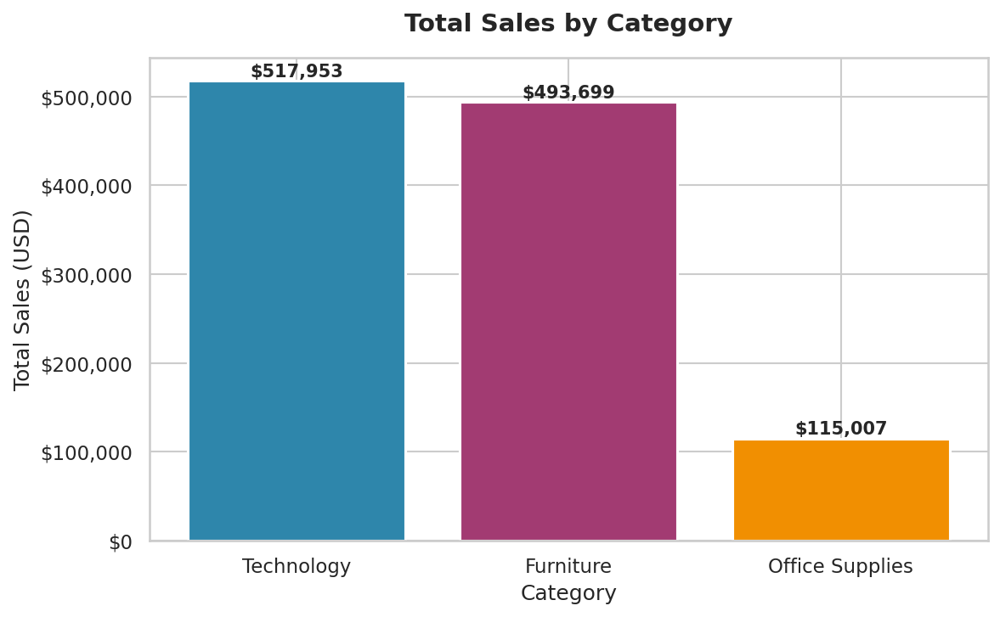
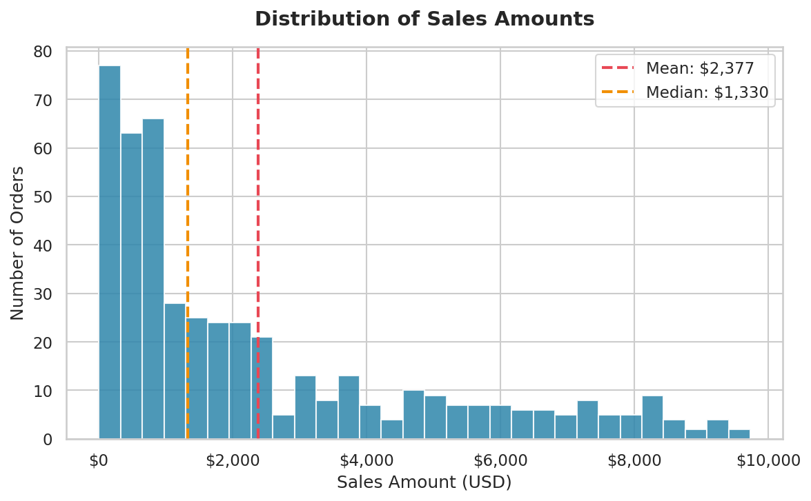
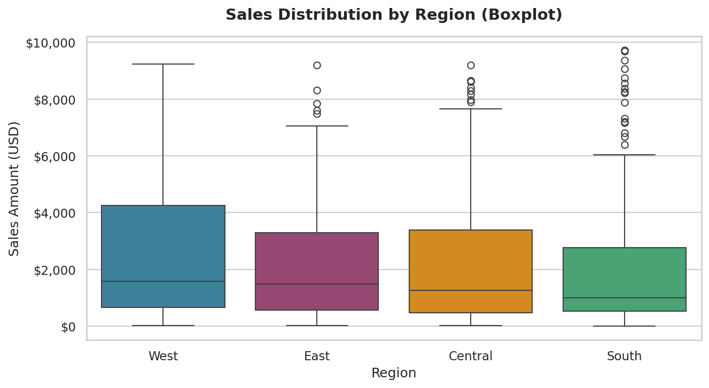
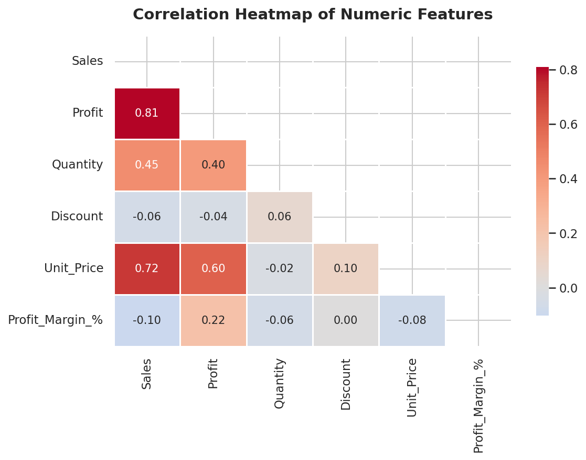
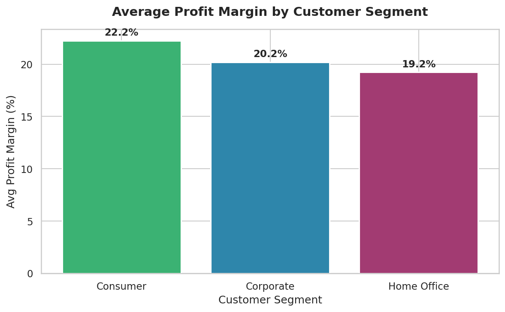

# 🛒 Data Cleaning & Visualization Project
### Superstore Sales Dataset | Python | Pandas | Matplotlib | Seaborn

---

## 📌 Project Overview

This project demonstrates a complete **Data Cleaning and Visualization** workflow using Python.  
We use a realistic Superstore Sales dataset (CSV format) to clean, process, and extract insights through visualizations.

---

## 📁 Project Structure

```
📦 superstore-data-project/
├── superstore_analysis.ipynb   ← Main Jupyter Notebook (run this!)
├── superstore_analysis.py      ← Same code as plain Python script
├── superstore_raw.csv          ← Original raw dataset (with issues)
├── superstore_cleaned.csv      ← Final cleaned dataset (output)
├── chart1_bar_category.png     ← Bar Chart: Sales by Category
├── chart2_histogram_sales.png  ← Histogram: Sales Distribution
├── chart3_boxplot_region.png   ← Boxplot: Sales by Region
├── chart4_heatmap.png          ← Heatmap: Correlation Matrix
├── chart5_segment_margin.png   ← Bar Chart: Profit Margin by Segment
└── README.md                   ← This file
```

---

## 🛠️ Tools & Libraries

| Tool | Purpose |
|------|---------|
| Python 3 | Programming language |
| Pandas | Data loading, cleaning, manipulation |
| NumPy | Numerical operations (IQR calculation) |
| Matplotlib | Base chart creation |
| Seaborn | Statistical visualizations |
| Jupyter Notebook | Interactive code execution |

---

## 🔧 How to Run

### Option 1: Jupyter Notebook (Recommended)
```bash
pip install pandas matplotlib seaborn numpy
jupyter notebook superstore_analysis.ipynb
```

### Option 2: Plain Python Script
```bash
python superstore_analysis.py
```

---

## 📊 Dataset Description

| Column | Description | Type |
|--------|-------------|------|
| Order_ID | Unique order identifier | Text |
| Order_Date | Date of the order | Date |
| Ship_Mode | Shipping speed selected | Text |
| Segment | Customer type (Consumer / Corporate / Home Office) | Text |
| Region | Geographic region (West / East / Central / South) | Text |
| Category | Product category | Text |
| Sub_Category | Specific product type | Text |
| Quantity | Number of items ordered | Number |
| Unit_Price | Price per unit (USD) | Number |
| Discount | Discount applied (0.0 – 0.5) | Number |
| Sales | Total revenue from the order | Number |
| Profit | Profit earned from the order | Number |

**Raw dataset:** 510 rows × 12 columns  
**Issues injected:** 10 duplicates, 24 missing values, 5 Sales outliers

---

## 🧹 Data Cleaning Steps

| Step | Problem | Solution | Records Affected |
|------|---------|----------|-----------------|
| 1 | Duplicate rows | `drop_duplicates()` | 10 removed |
| 2 | Missing `Profit` values | `fillna(median)` | 16 filled |
| 3 | Missing `Segment` values | `fillna(mode)` | 8 filled |
| 4 | Wrong date type | `pd.to_datetime()` | 500 converted |
| 5 | Sales outliers | IQR method | 26 removed |
| 6 | Negative-profit orders | Filter `Profit > 0` | Excluded |

**Final clean dataset:** 474 rows × 15 columns

---

## 📈 Visualizations

### Chart 1 — Bar Chart: Total Sales by Category
> Compares total revenue generated by each product category.



---

### Chart 2 — Histogram: Distribution of Sales
> Shows how many orders fall in each sales amount range.



---

### Chart 3 — Boxplot: Sales by Region
> Compares the spread and median of sales across all four regions.



---

### Chart 4 — Heatmap: Correlation Matrix
> Shows how strongly each pair of numeric variables is related.



---

### Chart 5 (Bonus) — Profit Margin by Segment
> Compares average profit efficiency across customer segments.



---

## 💡 Key Insights

1. **Technology dominates sales** — Technology (~$518K) and Furniture (~$494K) together account for 89% of total revenue.
2. **Most orders are small** — The histogram is right-skewed. Median sale = ~$1,330, but the mean is pulled to ~$2,377 by large orders.
3. **Sales drives profit (r = 0.81)** — The heatmap shows a strong positive correlation between Sales and Profit.
4. **South & West lead regionally** — South ($303K) and West ($302K) outperform Central and East regions.
5. **Consumer segment is most efficient** — With a 22.25% average profit margin, Consumer beats Corporate (20.21%) and Home Office (19.23%).

---

## ✅ Conclusion

This project successfully demonstrates:
- Loading and understanding raw CSV data with Pandas
- Identifying and fixing real data quality issues
- Engineering new analytical features
- Creating 5 professional visualizations with Matplotlib and Seaborn
- Extracting clear business insights from cleaned data

---

*Submitted as part of the Data Analytics course project — April 2026*
